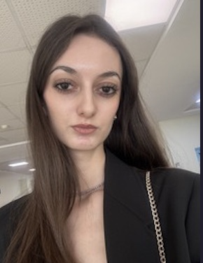

{fig-align="center"}

# Education

-   B.S., Industrial Engineering, Ankara Yildirim Beyazit University, Turkey, 2021-2025
-   M.S., Industrial Engineering, Hacettepe University, Turkey, 2026 - ongoing.

## Internships

1.  TAI, Production Planning Intern, 2024

## Projects

1.  TUBİTAK 2209-A The Mediating Role of the Digital Product Passport (DPP) in the Industry 4.0 Ecosystem for Circular Economy Efficiency

# Competencies

R, Quarto, Git, Python

# Hobbies

Piano, Violin, Books
